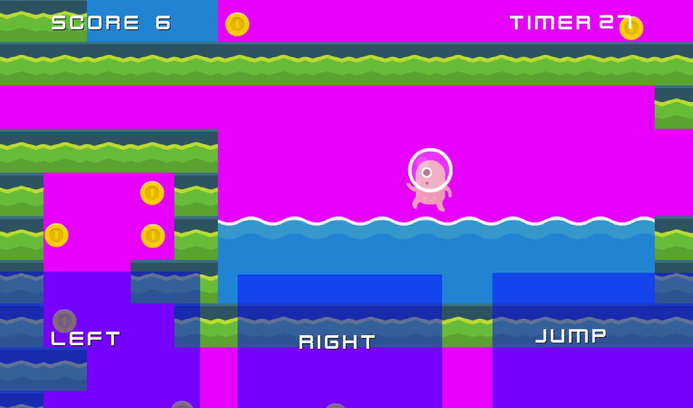

# Projects

## Pirate Wreckers

Pirate Wreckers is a game about being a pirate and trying to destroy the other ship. It isn't finished yet but I am improving on it.

* [Oculus Quest 1/2 VR](https://sidequestvr.com/app/4844/pirate-wreckers)
* [PC Version](https://xigua2011.github.io/pirate_wreckers/)

## Super Aliens

Super Aliens is a platform game about being and alien and trying to finish the obstacle courses. It saves your highscore and your fastest time.

* [Web version](https://xigua2011.github.io/Annis_platformer/)
* [Android mobile version](https://play.google.com/store/apps/details?id=org.godotengine.anniwang)

# About Me

I am 10 years old and have been doing coding since I was 8 with my teacher. My hobbies are gaming, music and experiencing different activities with my family. I am English and Chinese, but I love visiting different countries. 

My favourite subjects are maths, music and art.

 Here is a picture of my hamster that keeps me company!! :-)