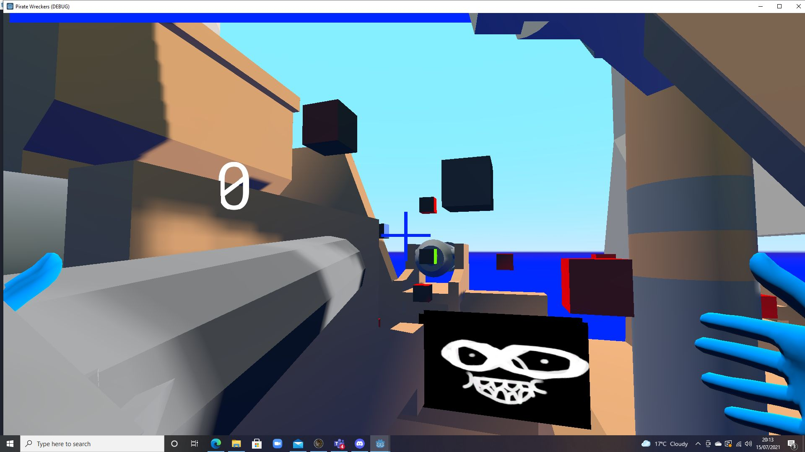

# Projects

## Flappy Helicopter

In flappy helicopter you have to dodge rocks and collects stars and powerups.

* [Web version](https://xigua2011.github.io/flappy_bird/)

## TankFight

Two player game: player 1 (a,s,d,w,space bar), player 2 (left,down,right,up,enter)
Use a,d,left,right to move.
Use s,w,down,up to change the angle of the shot.
Use space bar, enter and hold to shoot.

* [Web version](https://xigua2011.github.io/TankFight/)

## Pirate Wreckers

Pirate Wreckers is a game about trying to destroy the other ship and a clown on VR.

* [Oculus Quest 1/2 VR](https://sidequestvr.com/app/4844/pirate-wreckers)
* [PC Version](https://xigua2011.github.io/pirate_wreckers/)

## Super Aliens

Super Aliens is a platform game and you have to try finish the obstacle courses. It saves your highscore and your fastest time.

* [Web version](https://xigua2011.github.io/Annis_platformer/)
* [Android mobile version](https://play.google.com/store/apps/details?id=org.godotengine.anniwang)

# About Me

I am 12 years old and have been doing coding since I was 8 with my teacher. My hobbies are gaming and experiencing different activities with my family. I am English and Chinese, but I love visiting different countries. 

 Here is a picture of my hamster.